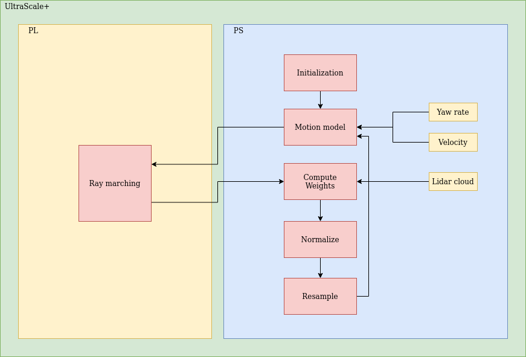

# Particle Filter Localization
Implementation in c++ of Particle Filter localization (based on [MIT particle filter](https://github.com/mit-racecar/particle_filter)) with ray casting. The 2d ray casting are implemented with ray marching algorithm for the following architectures:

* CPU
* FPGA
* GPU (*coming soon*)

## Workflow

### Inizialization

#### Pre Process map
The particle filter waits for the arrival of a map to preprocess it in this way the admissible zones and edges are defined. At this step, is also populated the sensor model table.

#### Initial Pose
When I obtain the initial position of the vehicle, I proceed to generate the first set of particles. These particles are distributed according to a normal distribution, and each particle is assigned a weight of 1.

#### Laser Scan
For each obtained laser scan, I perform the downsampling step by using the nearest neighbor method. At this point, I execute the localization update.

### Localizzation Update

#### Motion Model
The first step to update the localization is to apply the motion model. Specifically, odometry measurements (velocity and yaw rate) are added to all particles, along with some noise.

#### Sensor Model
With the obtained particles and with the downsampled laser scan I go to perform ray marching for each ray for each particle. At this point I am going to weigh and normalize each particle.

#### Update Pose
Based on the weights of the parcels I go to perform the state estimation step and after that I publish:
* an Odometry message containing the estimated pose
* the current particle states
* a TransformStamped containing the transformation from lidar_link to map using the estimated pose

#### Resampling Particles
Low variance resampling: This routine uses a single random number to sample from the particle set X with associated weights W, yet the probability of a particle to be resampled is still proportional to its weight.



## Usage
Use the `particle.launch.xml` launch file.
```bash
ros2 launch particle_filter particle.launch.xml
```

After a brief initialization phase, you may indicate an initial position using RVIZ2 (with the "set initial pose" button) and the algorithm should start running.

## Citations
This project accompanies the following publication. Please, cite/acknowledge this if you plan to use the code.  - 
[Link to paper](docs/bernardi_DATE22-tshot.pdf) - [Link to presentation](https://www.youtube.com/watch?v=rduWzMLe3R8)

```
@INPROCEEDINGS{9774517,
  author={Bernardi, Andrea and Brilli, Gianluca and Capotondi, Alessandro and Marongiu, Andrea and Burgio, Paolo},
  booktitle={2022 Design, Automation & Test in Europe Conference & Exhibition (DATE)}, 
  title={An FPGA Overlay for Efficient Real-Time Localization in 1/10th Scale Autonomous Vehicles}, 
  year={2022},
  volume={},
  number={},
  pages={915-920},
  doi={10.23919/DATE54114.2022.9774517}}
```

## License
**Apache 2.0** - [License](https://opensource.org/licenses/Apache-2.0)

## Authors
* **Andrea Bernardi** - [andreabernard](https://github.com/andreabernard)
* **Federico Gavioli** - [fgavioli](https://github.com/fgavioli) - _(Maintainer)_
* **Michele Guzzinati** - [mguzzinati](https://github.com/mguzzina)
* **Antonio Russo** - [russoanto](https://github.com/russoanto)

## PM
* **Alessandro Capotondi** - [acapotondi](https://github.com/alessandrocapotondi)
* **Paolo Burgio** - [pburgio](https://github.com/pburgio)

## AD Project
This project is part of the autonomous driving project of the university of Modena and Reggio Emilia, [read more](https://hipert.github.io/ad_site/).
