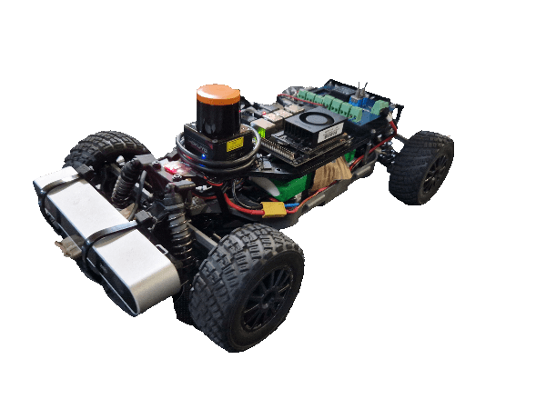

<div align="center">

# UNIMORE Roboracer Software Stack

</div>

<br/>


<br/>
<br/>
<div align="center">

This is the open-source repository for the Roboracer autonomous driving project at the University of Modena and Reggio Emilia.
<br/>
<br/>
[Autonomous Stack](#autonomous-stack) <span>&nbsp;&nbsp;•&nbsp;&nbsp;</span>
[Instructions](#instructions) <span>&nbsp;&nbsp;•&nbsp;&nbsp;</span>
[Contribute](#contribute) <span>&nbsp;&nbsp;•&nbsp;&nbsp;</span>
[Cite](#cite) <span>&nbsp;&nbsp;•&nbsp;&nbsp;</span>
[License](#license)
<br/>
<br/>


</div>

## Target Hardware Platform
The main target platform for this project is the Roboracer (formerly F1Tenth) research platform. For a complete bill of materials, building instructions and more about the platform, check out the official [Roboracer platform documentation](https://f1tenth.readthedocs.io/en/foxy_test/index.html).

<div align=center>



</div>

While the Roboracer platform is mainly based on a strict set of sensor and computer requirements, this repository mainly implements software for the following research prototypes

### KITT


KITT is our main Roboracer-compliant vehicle, equipped with a Hokuyo UST-10LX 2D LiDAR and an NVIDIA Jetson embedded computer. The vehicle is mostly used in autonomous racing use-cases and serves as the baseline platform for our research and development efforts.

KITT is also an educating platform used by students to learn autonomous driving concepts and it's the main vehicle deployed by HiPeRT Lab's Roboracer team in competitions.

### Thundershot (Coming soon)


Thundershot is our main FPGA-based embedded research platform, which is also equipped with a Hokuyo UST-10LX 2D LiDAR. It is based on an AMD Kria KR260. We plan to release our FPGA implementation of a 2D lidar localization pipeline.

<br/>

## Autonomous stack
This repository acts as a proof-of-concept software stack to drive scaled autonomous vehicles. It's split into several independent modules, each one implementing a specific functionality of the autonomous vehicle.

* [**`vehicle`**](src/vehicle/README.md) - vehicle description files, transformation fixed frames and support files related to each vehicle
* [**`adx_data`**](src/adx_data/README.md) - a lightweight and low-dependency library for handling data structures commonly used in autonomous driving
* [**`adx_data_ros`**](src/adx_data_ros/README.md) - ROS2 wrappers for adx_data types
* [**`adx_msgs`**](src/adx_msgs/README.md) - Custom ROS2 transport messages definitions
* [**`adx_curve`**](src/adx_curve/README.md) - a library for handling curves and splines
* [**`maps`**](src/maps/README.md) - maps and trajectories storage, plus means to serve them to nodes
* [**`particle_filter`**](src/particle_filter/README.md) - high-performance 2D LiDAR localization on embedded multi-core processors
* [**`path_handler`**](src/path_handler/README.md) - ROS2 utilities to handle paths and trajectories
* [**`purepursuit`**](src/purepursuit/README.md) - pure pursuit control on static and/or dynamic trajectories

For more information and instructions, you can check the README file in each module's root directory.

## Instructions
To build the repo and run a test demo of the system, please refer to the [instructions](./INSTRUCTIONS.md) file.

## Contribute
We gladly welcome contributions from the community
- Did you find a bug, unexpected behavior, or just something that can be improved? Open an issue and we will gladly discuss it
- You want to contribute something (small or big) to the project? Feel free to fork the repository and open a pull request on this repository. Please provide a clear description of your changes and/or how they affect the codebase. We will review your pull request and provide feedback as needed

## Cite
If you use the code in this repository for your research, please consider citing one or more of the following works:
<details>
<summary><a href="https://doi.org/10.23919/DATE58400.2024.10546748">Adaptive Localization for Autonomous Racing Vehicles with Resource-Constrained Embedded Platforms</a></summary>

```bibtex
@inproceedings{10546748,
  author={Gavioli, Federico and Brilli, Gianluca and Burgio, Paolo and Bertozzi, Davide},
  booktitle={2024 Design, Automation & Test in Europe Conference & Exhibition (DATE)},
  title={Adaptive Localization for Autonomous Racing Vehicles with Resource-Constrained Embedded Platforms},
  year={2024},
  doi={10.23919/DATE58400.2024.10546748}}
```
</details>

<details>
<summary><a href="https://doi.org/10.1016/j.sysarc.2024.103239">GPU implementation of the Frenet Path Planner for embedded autonomous systems: A case study in the F1tenth scenario</a></summary>

```bibtex
@article{MUZZINI2024103239,
title = {GPU implementation of the Frenet Path Planner for embedded autonomous systems: A case study in the F1tenth scenario},
journal = {Journal of Systems Architecture},
volume = {154},
pages = {103239},
year = {2024},
issn = {1383-7621},
doi = {https://doi.org/10.1016/j.sysarc.2024.103239},
author = {Filippo Muzzini and Nicola Capodieci and Federico Ramanzin and Paolo Burgio},
}
```
</details>

<details>
<summary><a href="https://doi.org/10.23919/DATE54114.2022.9774517">An FPGA Overlay for Efficient Real-Time Localization in 1/10th Scale Autonomous Vehicles</a></summary>

```bibtex
@INPROCEEDINGS{9774517,
  author={Bernardi, Andrea and Brilli, Gianluca and Capotondi, Alessandro and Marongiu, Andrea and Burgio, Paolo},
  booktitle={2022 Design, Automation & Test in Europe Conference & Exhibition (DATE)},
  title={An FPGA Overlay for Efficient Real-Time Localization in 1/10th Scale Autonomous Vehicles},
  year={2022},
  doi={10.23919/DATE54114.2022.9774517}}
```
</details>

## License
This repository is licensed under the [Apache License, Version 2.0](LICENSE.txt).